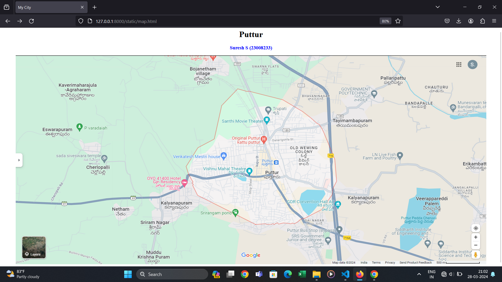
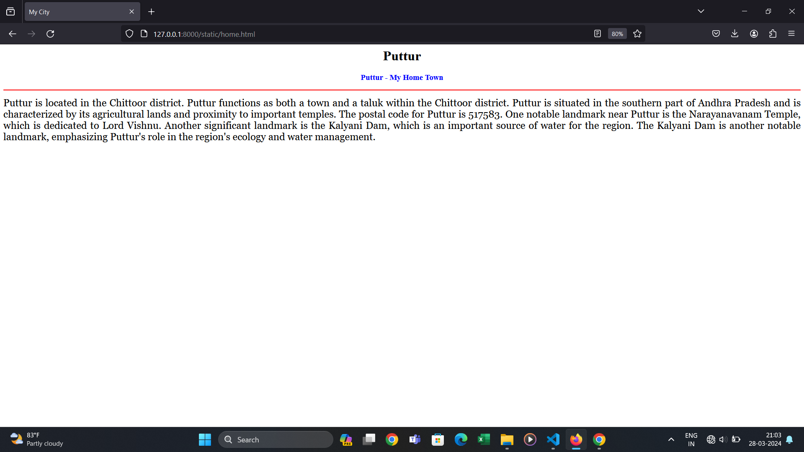
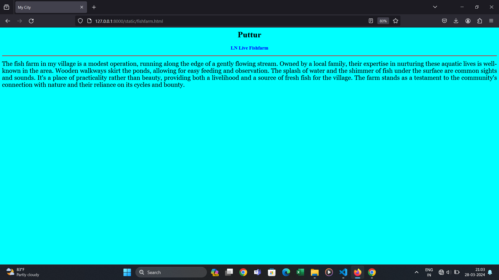
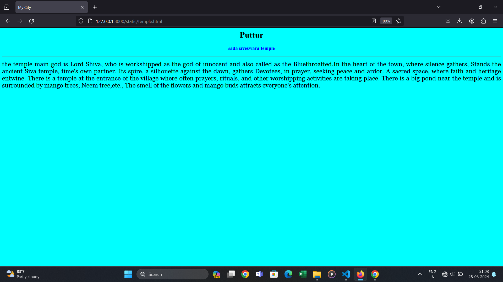
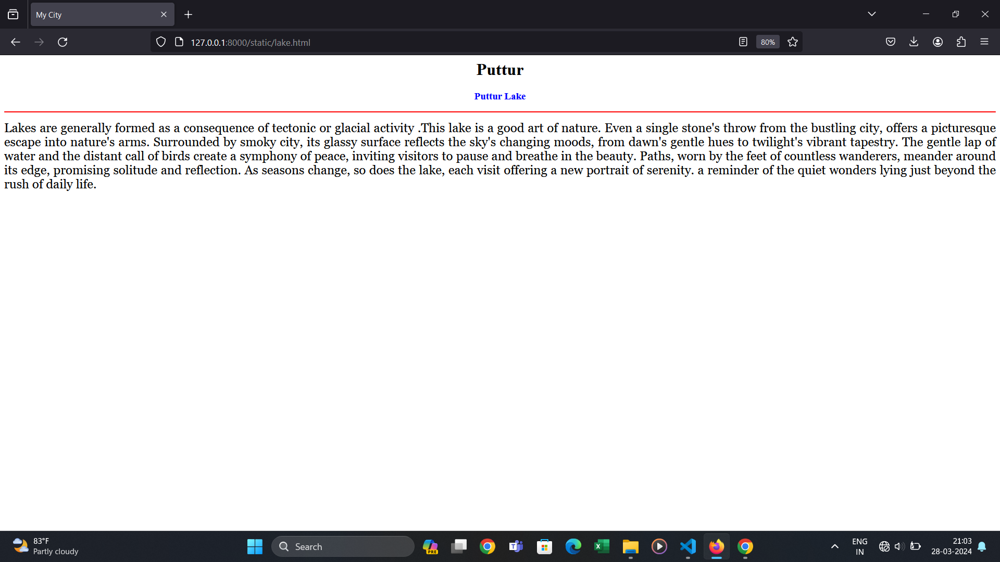
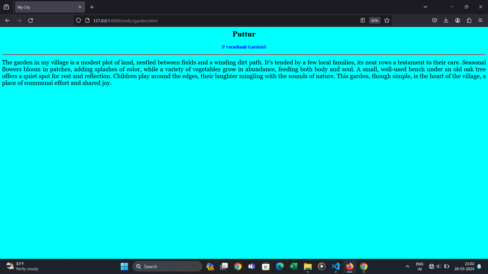

# Ex04 Places Around Me
## Date: 28-03-2024

## AIM
To develop a website to display details about the places around my house.

## DESIGN STEPS

### STEP 1
Create a Django admin interface.

### STEP 2
Download your city map from Google.

### STEP 3
Using ```<map>``` tag name the map.

### STEP 4
Create clickable regions in the image using ```<area>``` tag.

### STEP 5
Write HTML programs for all the regions identified.

### STEP 6
Execute the programs and publish them.

## CODE
```
<html>
    <head>
        <title>My City</title>

    </head>
    <body>
        <h1 align="center">
            <font color=""red><b>Puttur</b></font>
        </h1>
        <h3 align="center">
            <font color="blue"><b>Suresh S (23008233)</b></font>
        </h3>
        <center>
           
           <map name="MyCity">
            <area shape="rect" coords="600,100,1270,660" href="home.html" title="My Home Town">
            <area shape="rect" coords="240,380,420,470" href="temple.html" title="sada siveswara Temple">
            <area shape="rect" coords="1450,500,1630,750" href="lake.html" title="Puttur Lake">
            <area shape="rect" coords="190,250,320,315" href="garden.html" title="P varadaiah Garden">
            <area shape="rect" coords="1300,350,15200,430" href="fishfarm.html" title="LN Live Fish Farm">
           </map>
        </center>
    </body>
</html>

home.html
<html>
    <head>
        <title>My City</title>

    </head>
    <body bgcolor="cyan">
        <h1 align="center">
            <font color=""red><b>Puttur</b></font>
        </h1>
        <h3 align="center">
            <font color="blue"><b>Puttur - My Home Town</b></font>
        </h3>
        <hr size="3" color="red">
        <p align="justify">
            <font face="Georgia" size="5">
                Puttur is located in the Chittoor district.
                Puttur functions as both a town and a taluk within the Chittoor district.
                Puttur is situated in the southern part of Andhra Pradesh and is characterized by its agricultural lands and proximity to important temples.
                 The postal code for Puttur is 517583.
                 One notable landmark near Puttur is the Narayanavanam Temple, which is dedicated to Lord Vishnu. 
                 Another significant landmark is the Kalyani Dam, which is an important source of water for the region.
                 The Kalyani Dam is another notable landmark, emphasizing Puttur's role in the region's ecology and water management.
            </font>
        </p>
    </body>
</html>


fishfarm.html
<html>
    <head>
        <title>My City</title>

    </head>
    <body bgcolor="cyan">
        <h1 align="center">
            <font color=""red><b>Puttur</b></font>
        </h1>
        <h3 align="center">
            <font color="blue"><b>LN Live Fishfarm</b></font>
        </h3>
        <hr size="3" color="red">
        <p align="justify">
            <font face="Georgia" size="5">
                The fish farm in my village is a modest operation, running along the edge of a gently flowing stream.
                 Owned by a local family, their expertise in nurturing these aquatic lives is well-known in the area. 
                 Wooden walkways skirt the ponds, allowing for easy feeding and observation. 
                 The splash of water and the shimmer of fish under the surface are common sights and sounds. 
                 It's a place of practicality rather than beauty, providing both a livelihood and a source of fresh fish for the village. 
                The farm stands as a testament to the community's connection with nature and their reliance on its cycles and bounty.
            </font>
        </p>
    </body>
</html>


temple.html
<html>
    <head>
        <title>My City</title>

    </head>
    <body bgcolor="cyan">
        <h1 align="center">
            <font color=""red><b>Puttur</b></font>
        </h1>
        <h3 align="center">
            <font color="blue"><b>sada siveswara temple</b></font>
        </h3>
        <hr size="3" color="red">
        <p align="justify">
            <font face="Georgia" size="5">
                the temple main god is Lord Shiva, who is workshipped as the god of innocent and also called as the Bluethroatted.In the heart of the town, where silence gathers,
                Stands the ancient Siva temple, time's own partner. Its spire, a silhouette against the dawn, gathers Devotees, in prayer, seeking peace and ardor. A sacred space, where faith and heritage entwine.
                There is a temple at the entrance of the village where often prayers, rituals, and other worshipping activities are taking place.
                There is a big pond near the temple and is surrounded by mango trees, Neem tree,etc.,
                 The smell of the flowers and mango buds attracts everyone's attention.
            </font>
        </p>
    </body>
</html>


lake.html
<html>
    <head>
        <title>My City</title>

    </head>
    <body bgcolor="cyan">
        <h1 align="center">
            <font color=""red><b>Puttur</b></font>
        </h1>
        <h3 align="center">
            <font color="blue"><b>Puttur Lake</b></font>
        </h3>
        <hr size="3" color="red">
        <p align="justify">
            <font face="Georgia" size="5">
                Lakes are generally formed as a consequence of tectonic or glacial activity .This lake is a good art of nature. 
                Even a single stone's throw from the bustling city, offers a picturesque escape into nature's arms. 
                Surrounded by smoky city, its glassy surface reflects the sky's changing moods, from dawn's gentle hues to twilight's vibrant tapestry. 
                The gentle lap of water and the distant call of birds create a symphony of peace, inviting visitors to pause and breathe in the beauty. 
                Paths, worn by the feet of countless wanderers, meander around its edge, promising solitude and reflection. As seasons change, so does the lake, each visit offering a new portrait of serenity. 
                a reminder of the quiet wonders lying just beyond the rush of daily life.
            </font>
        </p>
    </body>
</html>

garden.html

<html>
    <head>
        <title>My City</title>

    </head>
    <body bgcolor="cyan">
        <h1 align="center">
            <font color=""red><b>Puttur</b></font>
        </h1>
        <h3 align="center">
            <font color="blue"><b>P varadiaah GardenS</b></font>
        </h3>
        <hr size="3" color="red">
        <p align="justify">
            <font face="Georgia" size="5">
                The garden in my village is a modest plot of land, nestled between fields and a winding dirt path.
                 It's tended by a few local families, its neat rows a testament to their care. 
                 Seasonal flowers bloom in patches, adding splashes of color, while a variety of vegetables grow in abundance, feeding both body and soul.
                  A small, well-used bench under an old oak tree offers a quiet spot for rest and reflection. 
                  Children play around the edges, their laughter mingling with the sounds of nature.
                   This garden, though simple, is the heart of the village, a place of communal effort and shared joy.
            </font>
        </p>
    </body>
</html>


```
## OUTPUT








## RESULT
The program for implementing image maps using HTML is executed successfully.
